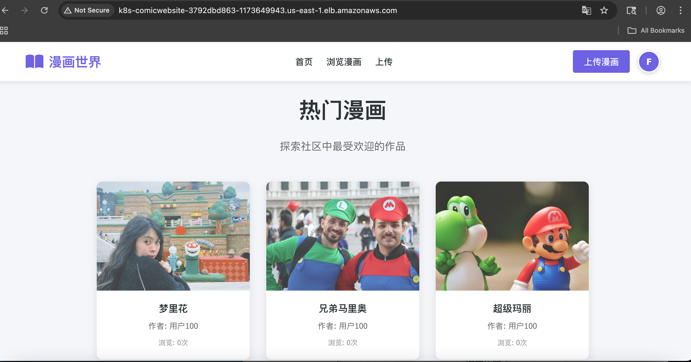
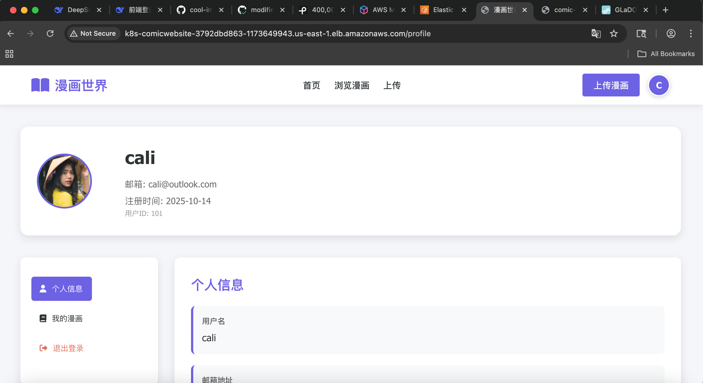
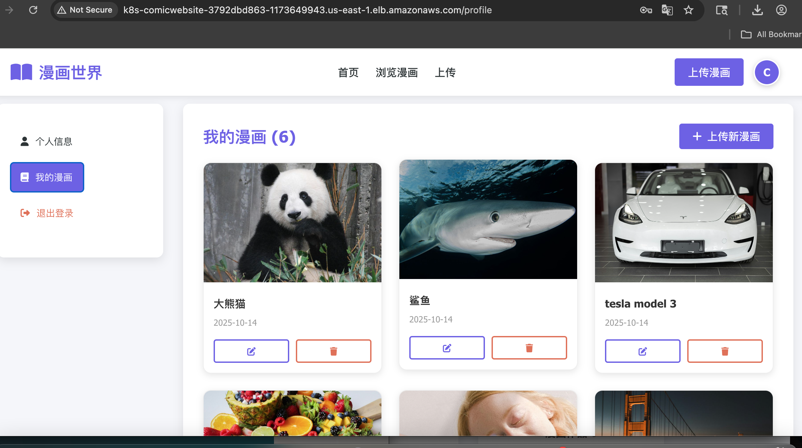
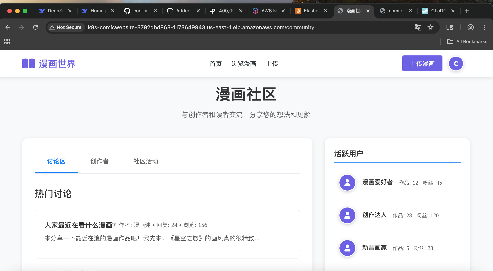

# COOL-IMAGE-GALLERY-AWS-EKS

In this demo, I will create a comic website, this site is for view comic images which allows users to browse the photos and registered users can upload and share their own comic photos. registered users have their own profile page and can see their uploaded images and change their avatars.

## Features

- Frontend
    - React
    - Node.js (for build tooling)
- Backend 
    - Node.js
    - Express.js
    - Docker (with isolated container for community features)
- Database 
    - AWS RDS PostgreSQL
    - AWS Elastichche (redis)

- Terraform to create the infrastructure including EKS modules, ECR modules, IAM modules, Redis  

  (Elasticache) modules, S3 modules(to store iamges uploaded by users), VPC modules .

- Github CICD to deploy frontend, backend, commnity to EKS pods

- ALB for a client access and API route to backend and community services

## Usage

- You need to set the follwing variables in your github secrets

     - AWS_ACCESS_KEY_ID
     - AWS_SECRET_ACCESS_KEY
     - DB_PASSWORD
     - DB_USERNAME
     - JWT_SECRET
     - RDS_DATABASE
     - COMMUNITY_DB_NAME
     - COMMUNITY_DB_PASSWORD
     - COMMUNITY_DB_USERNAME

- You need to check your EKS OIDC for the alb-ingress-controller creation

- Here's the Home page looks like:

- Here's the Profile page looks like:

- Here's the comic images colletion which registered users uploaded

- Here's the community for commits and likes:

Designed and Developed by Pengchao Ma @2025